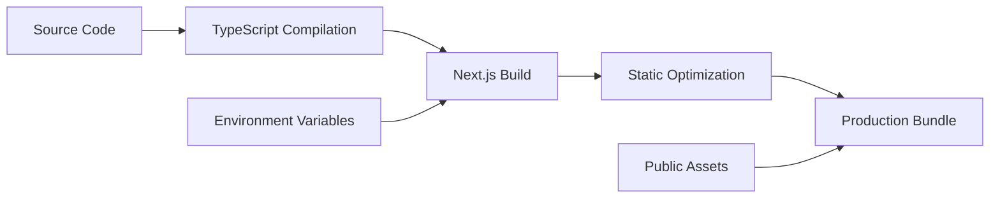

# Project Structure Documentation

## 📁 Directory Overview

```
template-typescript-nextjs/
├── 📁 app/                      # Next.js 15 App Router
│   ├── 📁 api/                  # API Routes
│   │   └── 📁 health/           # Health check endpoint
│   ├── 📁 auth/                 # Authentication pages
│   │   ├── 📁 signin/           # Login page
│   │   └── 📁 signup/           # Registration page
│   ├── favicon.ico              # App favicon
│   ├── globals.css              # Global styles
│   ├── layout.tsx               # Root layout
│   └── page.tsx                 # Home page
│
├── 📁 components/               # React components
│   ├── 📁 forms/               # Form components
│   │   ├── sign-in-form.tsx    # Login form
│   │   └── sign-up-form.tsx    # Registration form
│   └── 📁 ui/                  # UI components (shadcn/ui)
│       ├── badge.tsx           # Badge component
│       ├── button.tsx          # Button component
│       ├── card.tsx            # Card component
│       ├── form.tsx            # Form utilities
│       ├── input.tsx           # Input component
│       ├── label.tsx           # Label component
│       └── table.tsx           # Table component
│
├── 📁 config/                   # Configuration files
│
├── 📁 docs/                     # Documentation (generated)
│   ├── API.md                  # API documentation
│   └── PROJECT_STRUCTURE.md   # This file
│
├── 📁 hooks/                    # Custom React hooks
│   ├── 📁 user/                # User-specific hooks
│   │   ├── use-crud-user-api.ts  # Auto-generated CRUD
│   │   └── use-user-api.ts       # Custom user hooks
│   ├── use-auth-api.ts         # Authentication hooks
│   ├── use-query-state.ts      # Query state management
│   └── use-query-utils.ts      # Query utilities
│
├── 📁 lib/                      # Core utilities
│   ├── api.ts                  # API client
│   ├── constants.ts            # App constants
│   ├── env-validator.ts        # Environment validation
│   ├── error-handler.ts        # Error handling
│   ├── query-builder.ts        # Query construction
│   ├── query-invalidation.ts   # Cache management
│   ├── request-deduplicator.ts # Request optimization
│   ├── token-manager.ts        # JWT management
│   └── utils.ts                # General utilities
│
├── 📁 providers/                # React context providers
│   ├── query-provider.tsx      # TanStack Query provider
│   └── token-monitor-provider.tsx # Token monitoring
│
├── 📁 public/                   # Static assets
│   ├── file.svg
│   ├── globe.svg
│   ├── next.svg
│   ├── vercel.svg
│   └── window.svg
│
├── 📁 scripts/                  # Utility scripts
│   ├── generate-crud.js        # CRUD generator
│   └── validate-env.js         # Environment validator
│
├── 📁 store/                    # State management
│   └── auth-store.ts           # Authentication store
│
├── 📁 styles/                   # Additional styles
│
├── 📁 types/                    # TypeScript definitions
│   ├── 📁 user/                # User types
│   │   ├── crud-user.ts       # Auto-generated types
│   │   └── user.ts            # Custom user types
│   ├── api.ts                  # API types
│   ├── auth.ts                 # Auth types
│   ├── crud.ts                 # CRUD types
│   ├── query.ts                # Query types
│   └── store.ts                # Store types
│
├── .env.example                # Environment template
├── .env.local                  # Local environment (gitignored)
├── .gitignore                  # Git ignore rules
├── components.json             # shadcn/ui config
├── eslint.config.mjs           # ESLint configuration
├── next-env.d.ts               # Next.js types
├── next.config.ts              # Next.js configuration
├── package.json                # Dependencies
├── postcss.config.mjs          # PostCSS configuration
├── railway.toml                # Railway deployment
├── README.md                   # Project documentation
├── tsconfig.json               # TypeScript configuration
└── yarn.lock                   # Yarn lockfile
```

## 🏗️ Architecture Layers

### 1. **Presentation Layer** (`/app`, `/components`)
- **App Router**: Next.js 15 file-based routing
- **Components**: Reusable UI components
- **Pages**: Route-specific components
- **Forms**: Specialized form components

### 2. **Business Logic Layer** (`/hooks`, `/lib`)
- **Hooks**: Business logic and API integration
- **Utilities**: Core functionality and helpers
- **Query Management**: Data fetching and caching

### 3. **Data Layer** (`/types`, `/store`)
- **Type Definitions**: TypeScript interfaces
- **State Management**: Global application state
- **Data Models**: Entity type definitions

### 4. **Infrastructure Layer** (`/scripts`, `/config`)
- **Build Scripts**: Code generation tools
- **Configuration**: App and deployment config
- **Environment**: Settings management

## 📦 Module Organization

### Auto-Generated vs Custom Files

```
Pattern: crud-[entity].ts → Auto-generated (overwritten)
Pattern: [entity].ts     → Custom extensions (preserved)
```

**Example Structure:**
```
hooks/user/
├── use-crud-user-api.ts  # 🤖 Auto-generated - DO NOT EDIT
└── use-user-api.ts       # ✏️ Custom code - Safe to edit

types/user/
├── crud-user.ts          # 🤖 Auto-generated - DO NOT EDIT
└── user.ts               # ✏️ Custom code - Safe to edit
```

### Entity Module Pattern

Each entity follows this structure:
```
[entity]/
├── types/[entity]/
│   ├── crud-[entity].ts    # Base CRUD types
│   └── [entity].ts         # Extended types
├── hooks/[entity]/
│   ├── use-crud-[entity]-api.ts  # Base CRUD hooks
│   └── use-[entity]-api.ts       # Extended hooks
```

## 🔧 Key Files Explained

### Core API Files

#### `lib/api.ts`
- HTTP client configuration
- Token injection middleware
- Error handling
- Request/response interceptors

#### `lib/query-builder.ts`
- Fluent API for query construction
- Filter, sort, pagination helpers
- Type-safe query building

#### `lib/token-manager.ts`
- JWT token storage
- Automatic token refresh
- Expiration monitoring
- Cross-tab synchronization

### Hook Files

#### `hooks/use-auth-api.ts`
- Login/logout mutations
- Signup functionality
- Token refresh logic
- User profile queries

#### `hooks/use-query-state.ts`
- Pagination state management
- Sort and filter state
- Query builder integration
- URL state synchronization

### Type Definition Files

#### `types/api.ts`
- API response structures
- Error type definitions
- Pagination types
- HTTP method types

#### `types/crud.ts`
- CRUD operation types
- Query parameter types
- Filter operator definitions
- Sort and pagination types

### Configuration Files

#### `next.config.ts`
- Next.js settings
- Environment variables
- Build optimizations
- Routing configuration

#### `tsconfig.json`
- TypeScript compiler options
- Path aliases (@/ mapping)
- Strict type checking
- Module resolution

#### `components.json`
- shadcn/ui configuration
- Component styling
- Tailwind integration
- Import aliases

## 🚀 Development Workflow

### 1. **Adding New Entities**
```bash
npm run generate-crud
# Enter entity name (e.g., "product")
# Creates:
#   - types/product/crud-product.ts
#   - hooks/product/use-crud-product-api.ts
```

### 2. **Extending Generated Code**
```typescript
// Create custom extension files:
// types/product/product.ts
export interface ProductExtended extends Product {
  customField: string
}

// hooks/product/use-product-api.ts
export class ProductApi extends CrudProductApi {
  customMethod() {
    // Custom implementation
  }
}
```

### 3. **Using in Components**
```typescript
import { useProductApi } from '@/hooks/product/use-product-api'

function ProductList() {
  const productApi = useProductApi()
  const { data } = productApi.index()
  // Component implementation
}
```

## 📝 File Naming Conventions

### TypeScript Files
- **Components**: PascalCase (`Button.tsx`, `UserCard.tsx`)
- **Hooks**: camelCase with 'use' prefix (`useAuth.ts`, `useQuery.ts`)
- **Utilities**: camelCase (`api.ts`, `utils.ts`)
- **Types**: camelCase (`user.ts`, `api.ts`)
- **Constants**: camelCase or UPPER_SNAKE (`constants.ts`)

### Generated Files
- **CRUD Types**: `crud-[entity].ts`
- **CRUD Hooks**: `use-crud-[entity]-api.ts`
- **Pattern**: Always prefixed with `crud-` for identification

### Directory Names
- **Always lowercase**: `components`, `hooks`, `lib`
- **Plural for collections**: `types`, `hooks`, `components`
- **Singular for entities**: `user`, `product`, `category`

## 🔒 Security Considerations

### Sensitive Files
- `.env.local` - Never commit (gitignored)
- `lib/token-manager.ts` - Handles JWT securely
- `lib/api.ts` - Manages API keys

### Public vs Private
- `/public` - Publicly accessible assets
- `/app/api` - Server-side API routes
- Environment variables starting with `NEXT_PUBLIC_` are exposed to browser

## 🎯 Best Practices

### 1. **Separation of Concerns**
- Keep components pure and focused
- Business logic in hooks
- Data types in `/types`
- API calls through `/lib/api.ts`

### 2. **Code Generation**
- Never edit `crud-*.ts` files
- Extend through inheritance
- Regenerate when backend changes

### 3. **Type Safety**
- Use TypeScript strict mode
- Define all API responses
- Avoid `any` types

### 4. **Performance**
- Use dynamic imports for large components
- Implement proper caching strategies
- Optimize bundle size

## 🔄 Build Pipeline



## 📊 Dependency Graph

### Core Dependencies
- **next**: Framework
- **react**: UI library
- **typescript**: Type system
- **@tanstack/react-query**: Data fetching
- **zod**: Schema validation
- **zustand**: State management
- **ky**: HTTP client

### UI Dependencies
- **@radix-ui**: Headless components
- **tailwindcss**: Styling
- **clsx**: Class utilities
- **tailwind-merge**: Class merging
- **framer-motion**: Animations

### Development Dependencies
- **eslint**: Code linting
- **@types/***: Type definitions
- **tw-animate-css**: Animation utilities